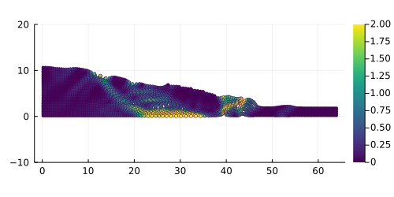

```@meta
CurrentModule = elastoPlasm
```

# Documentation for [ϵlastσPlasm.jl](https://github.com/ewyser/elastoPlasm.jl) 👻 

```@index
```

## Overview
This project originates from [`ep2-3De v1.0`](https://github.com/ewyser/ep2-3De) and is fully witten in Julia. It solves explicit elasto-plastic problems within a finite deformation framework (*i.e.,* adopting logarithmic strains and Kirchoff stresses, which allows the use of conventional small-strain stress integration algorithms within a finite deformation framework), using the **m**aterial **p**oint **m**ethod (MPM) with b-spline shape functions alongside with a mUSL approach.

 

The solver relies on random gaussian fields to generate initial fields $\psi(\boldsymbol{x})$, *e.g.,* the cohesion $c(\boldsymbol{x}_p)$ or the internal friction angle $\phi(\boldsymbol{x}_p)$, with $\boldsymbol{x}_p$ the material point's coordinates. 


## **Content**
1. [Usage](#id-section2)
<div id='id-section2'/> 
