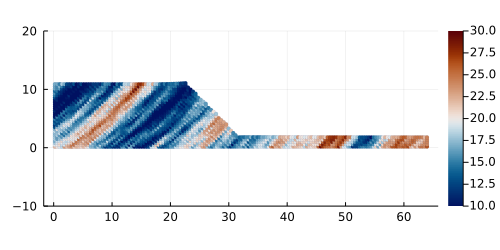

<div style="max-width:500px; word-wrap:break-word;">

# ***ϵlastσPlasm.jl*** # 
## **Description** 
This project originates from [``ep2-3De v1.0``](https://github.com/ewyser/ep2-3De) and is fully witten in Julia. It solves explicit elasto-plastic problems within a finite deformation framework (*i.e.,* adopting logarithmic strains and Kirchoff stresses, which allows the use of conventional small-strain stress integration algorithms within a finite deformation framework), using the **material point method** with **{ b-spline|gimp|standard} shape functions** alongside with a **{mUSL|TPIC} approach**.

<p align="center">
  
</p>

* **Fig |** Slumping dynamics (without any volumetric locking corrections) showing the accumulated plastic strain $\epsilon_p^{\mathrm{acc}}$ after an elastic load of 8 s and an additional elasto-plastic load of $\approx$ 7 s. 

The solver relies on random gaussian fields to generate initial fields $\psi(\boldsymbol{x})$, *e.g.,* the cohesion $c(\boldsymbol{x}_p)$ or the internal friction angle $\phi(\boldsymbol{x}_p)$, with $\boldsymbol{x}_p$ the material point's coordinates. 

<p align="center">
  
</p>

* **Fig |** Initial cohesion field $c_0(\boldsymbol{x}_p)$ with average $\mu=20$ kPa with a variance $\sigma\pm5$ kPa.

## **Content**
1. [Usage](#id-section2)
<div id='id-section2'/> 

## **Usage**

### How to ```plasmazing``` ?  

0. (opt.) Get Julia [here](https://julialang.org/downloads/) and follow instructions for installation
1. ``cd`` to the local repo ```./elastoPlasm ``` 
2. Launch Julia (on macOS, drag & drop ```start_macOS.sh``` in the terminal)
```julia
manuwyser@mBp elastoPlasm.jl % julia --project=. --threads=1
               _
   _       _ _(_)_     |  Documentation: https://docs.julialang.org
  (_)     | (_) (_)    |
   _ _   _| |_  __ _   |  Type "?" for help, "]?" for Pkg help.
  | | | | | | |/ _` |  |
  | | |_| | | | (_| |  |  Version 1.6.5 (2021-12-19)
 _/ |\__'_|_|_|\__'_|  |  Official https://julialang.org/ release
|__/                   |
```
3. Enter pkg mode ``` ] ```, then ``activate .`` the project ``elastoPlasm`` and ``instantiate`` its environment and related packages. You can ``st`` to check package status.
```julia
(elastoPlasm) pkg> st
Project elastoPlasm v0.3.5
Status `~/Dropbox/Jobs/git/elastoPlasm.jl/Project.toml`
  [6e4b80f9] BenchmarkTools v1.5.0
⌃ [052768ef] CUDA v5.4.3
  [f67ccb44] HDF5 v0.17.2
⌃ [63c18a36] KernelAbstractions v0.9.22
  [b964fa9f] LaTeXStrings v1.3.1
⌃ [91a5bcdd] Plots v1.40.5
  [92933f4c] ProgressMeter v1.10.2
  [295af30f] Revise v3.6.0
  [37e2e46d] LinearAlgebra
  [44cfe95a] Pkg v1.9.2
  [3fa0cd96] REPL
  [9a3f8284] Random
  [2f01184e] SparseArrays
Info Packages marked with ⌃ have new versions available and may be upgradable.

(elastoPlasm) pkg> 

```
4. Once ```elastoPlasm``` has been correctly instantiated, you can ```using elastoPlasm```

```juliaREPL
julia> using elastoPlasm
[ Info: Precompiling elastoPlasm [ff84b311-7f94-4593-ba3b-b1d6d2226836]
┌ Info: elastoPlasm: sucessful superInclude()
│ 	✓ init/scripts
│ 	✓ init/misc
│ 	✓ init/fun
└ 	✓ init/api

julia> names(elastoPlasm)
6-element Vector{Symbol}:
 :allocCheck
 :configPlot
 :e2eTest
 :elastoPlasm
 :slump
 :ϵp23De!

julia> 
julia> 
```

5. Input parameters: ``L`` is a vector of the Eulerian mesh dimensions $\ell_{x,z|x,y,z}$ (two- and three-dimensional geometries are now supported since ``v0.3.0``), the argument ``nel`` defines the elements along the $x$ dim., ``varPlot`` defines state variable to be displayed in plot (``"P"`` for pressure, ``"du"`` for displacement or ``"epII"`` for plastic strain), and ``cmType`` defines the constitutive model being used. 

6. Optional ``kwargs`` are: ``shpfun={:smpm,:gimpm,:bsmpm}`` defining shape functions, ``fwrk={:infinitesimal,:finite}`` defining the deformation framework, ``trsf={:picflipUSL,:mUSL,:tpicUSL}`` defining the mapping scheme, ``vollock={true|false}`` is a boolean controlling volumetric locking corrections using the $\Delta\bar{F}$ method (see [1,2]), and ``GRF={true|false}`` is a boolean switching on/off gaussian random cohesion fields (see [3,4]). An illustrative example with ``kwargs`` is given below
```julia
ϵp23De([64.1584,12.80],40,"P","MC";shpfun=:bsmpm,fwrk=:finite,trsf=:mUSL,vollock=true)
```

7. Outputs (figs, gif, etc.) are saved in the folder ```./docs/out/ ```

8. (**final note**): ``ϵp23De`` automatically infers whether the two- or three-dimensional solver should be compiled, solely based on the dimension of ``L``, *i.e.,* ``length(L)={2|3}``.

## **References**
For useful references, the reader can have a look in the folder ```./docs/refs```, where some of the following references can be found

1. Xie M., Navas P., López-Querol S. An implicit locking-free B-spline Material Point
Method for large strain geotechnical modelling. Int J Numer Anal Methods Geomech. 2023;1-21.
https://doi.org/10.1002/nag.3599

2. Zhao Y., Jiang C., Choo J. Circumventing volumetric locking in explicit material point
methods: A simple, efficient, and general approach. Int J Numer Methods Eng. 2023;1-22. https://doi.org/10.1002/nme.7347

3. Räss, L., Kolyukhin D., and Minakov, A. Efficient parallel random field generator for large 3-D geophysical problems. Computers & Geosciences. 2019;158-169. https://doi.org/10.1016/j.cageo.2019.06.007

4. Ma, G., Rezania, M., Mousavi Nezhad, M. et al. Uncertainty quantification of landslide runout motion considering soil interdependent anisotropy and fabric orientation. Landslides 12022:1231–1247. https://doi.org/10.1007/s10346-021-01795-2
</div>

